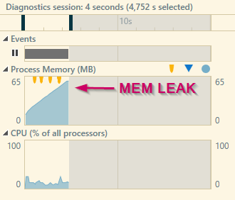

## Description
Different Xml Serialization options.
Notice there is one demonstration of a memory leak.


## naiveApproach
time for 1000 loops: 00:00:00.1894996
```
<?xml version="1.0" encoding="utf-16"?>
<ArrayOfInt xmlns:xsi="http://www.w3.org/2001/XMLSchema-instance" xmlns:xsd="http://www.w3.org/2001/XMLSchema">
  <int>1</int>
  <int>2</int>
  <int>3</int>
  <int>4</int>
  <int>5</int>
</ArrayOfInt>
```

## naiveApproachWithCustomRootElement (memory leak)
time for 1000 loops: 00:00:15.0232130
```
<?xml version="1.0" encoding="utf-16"?>
<MyData xmlns:xsi="http://www.w3.org/2001/XMLSchema-instance" xmlns:xsd="http://www.w3.org/2001/XMLSchema">
  <int>1</int>
  <int>2</int>
  <int>3</int>
  <int>4</int>
  <int>5</int>
</MyData>
```



## naiveApproachFixed (fixed)
time for 1000 loops: 00:00:00.0319149
```
<?xml version="1.0" encoding="utf-16"?>
<MyData xmlns:xsi="http://www.w3.org/2001/XMLSchema-instance" xmlns:xsd="http://www.w3.org/2001/XMLSchema">
  <int>1</int>
  <int>2</int>
  <int>3</int>
  <int>4</int>
  <int>5</int>
</MyData>
```

## datacontractApproach
time for 1000 loops: 00:00:00.1206794
```
<ArrayOfint xmlns:i="http://www.w3.org/2001/XMLSchema-instance" xmlns="http://schemas.microsoft.com/2003/10/Serialization/Arrays">
  <int>1</int>
  <int>2</int>
  <int>3</int>
  <int>4</int>
  <int>5</int>
</ArrayOfint>
```

## withPicklerLibrary
time for 1000 loops: 00:00:00.4434285
```
<?xml version="1.0" encoding="utf-16"?>
<FsPickler version="4.0.0.0" type="System.Int32[]">
  <value flags="sequence">
    <elem>1</elem>
    <elem>2</elem>
    <elem>3</elem>
    <elem>4</elem>
    <elem>5</elem>
  </value>
</FsPickler>
```
